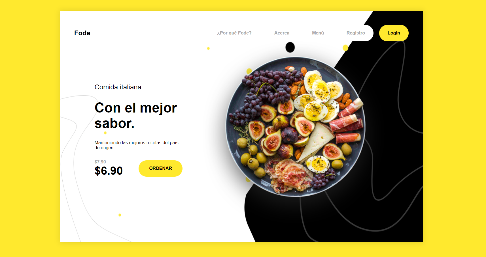

# Reto Saas - Desarrollo de un sitio web con Sass: Syntactically Awesome Style Sheets

Este es el desarrollo de un reto propio para el aprendizaje y práctica del preprocesador de CSS Saas.
([Saass Web](https://sass-lang.com/))

## Tabla de contenido

### Vista previa

### Links

- Ver en vivo el desarrollo: [Add live site URL here](https://carlosmunera.github.io/website_sass/)

## Proceso de desarrollo

### Tecnologías utilizadas

- HTML5
- CSS
- Flexbox
- SCSS - Preprocesador de CSS [Saas](https://sass-lang.com/) 

### Lo aprendido
Usar un preprocesador de CSS como Saas ayuda a agilizar y mejorar la eficiencia en el proceso de desarrollo web front end, ya que nos da la capacidad de aplicar los estilos CSS utilizando paradigmas de los lenguajes de programación, esto permite que se pueda escribir un código de manera mas clara, estandarizada para los diversos nevegadores existentes, con código de facil mantenimiento y reutilizable.

Entre las características más destacadas de este preprocesador:

- Saas permite definir variables, codigo reutilizable para los colores, fuentes, tamaños, margenes, etc,  que permiten realizar un cambio global en el diseño.

- Anidar estilos: genera un código más intuitivo y fácil de entender.

- Mixins, funciones, operadores:  permiten generar bloques de codigo css reutilizable, hacer cálculos, crear bucles y aplicar lógica condicional.

- Modularidad, Saas permite crear archivos CSS modulares para mejorar la organización y gestión del codigo, estos modulos pueden ser compilados en solo archivo CSS.

## Author:  Carlos Múnera

- [Alura - Oracle ONE Next Education.](https://app.aluracursos.com/user/karlosmunera)
- [Linked In.](https://www.linkedin.com/in/carlos-munera-259969262)
